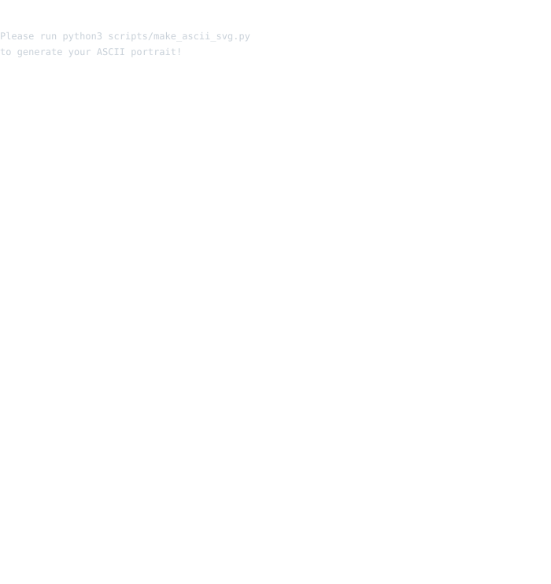

  <!-- Header / Contributions Heatmap -->
  
     
  
  <!-- Whoami Command & Panels -->
  <h3><code>mohit@github ~ $ whoami</code></h3>
   
  <table border="0" cellpadding="0" cellspacing="0" style="border-collapse: collapse; border: none; margin: 0 auto;">
    <tr style="border: none;">
      <td valign="top" style="border: none; padding: 0 10px;">
        
      </td>
      <td valign="top" style="border: none; padding: 0 10px;">
        
      </td>
    </tr>
  </table>
  
     

  <!-- Links Command & Social Badges -->
  <h3><code>mohit@github ~ $ ./links.sh</code></h3>
   
  <h4>Software Engineer • AI Builder • Tech Enthusiast</h4>
   
  
  

    
    
    
  

  

    
  

  
     

  <!-- Extra Creative Section: Skills/Tech Stack -->
  <h3><code>mohit@github ~ $ cat skills.txt</code></h3>
   
  
  

    
    
    
    
    
    
    
    
  

